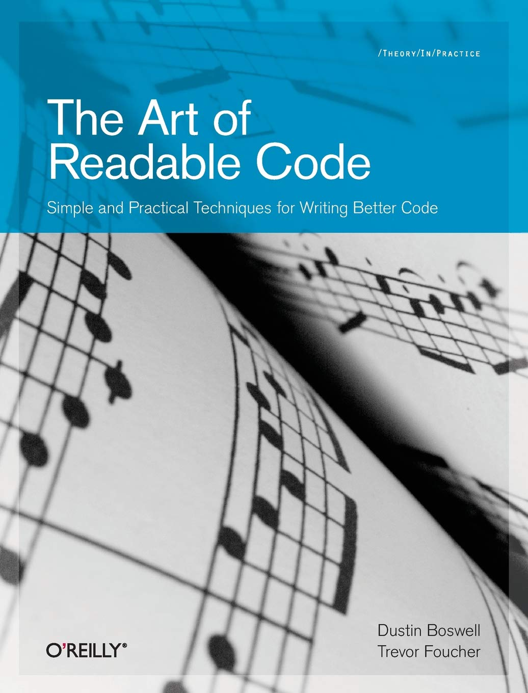

class: inverse middle

```{r setup, include=FALSE}
options(htmltools.dir.version = FALSE)
knitr::opts_chunk$set(
  fig.width=9, fig.height=3.5, fig.retina=3,
  out.width = "100%",
  cache = FALSE,
  echo = TRUE,
  message = FALSE, 
  warning = FALSE,
  fig.show = TRUE,
  hiline = TRUE,
  comment = "#>",
  fig.retina = 3
)
library(tibble)
library(magrittr)
library(dplyr)
```

```{r xaringan-themer, include=FALSE, warning=FALSE}
library(xaringanthemer)
style_duo_accent(primary_color = "#035AA6", secondary_color = "#F97B64")
```

<font size="5">

.pull-left[
```{r echo=FALSE}
cowsay::say("Hola a todos!", by = "cow")
```
]

.pull-right[
Analytics Developer (`r fontawesome::fa("r-project", fill="black")` package developer) en **Kantar**

<br>
`r emo::ji("croissant")` `r emo::ji("coffee")`  amante del pan.
]

???

---
<br>
<br>
<br>
<br>
<br>
<font size="5">
*  Mantenemos un ecosistema de más de 10 paquetes en **R**.
* Desarrollamos código de forma colaborativa en un equipo de 4 integrantes.
* Otros equipos de la organización pueden ver tu código.
* Los paquetes son usados para generar cerca de 10,000 análisis al mes.
<br>

--

**Seguir las buenas prácticas de escritura de código se vuelve imperativo**

--

---
<font size="5">
<br>
<br>
.pull-left[
<br>
<br>
<br>
<br>
  Esta keynote está basada en el libro **The Art of Readable Code** (2012) de Dustin Boswell y Trevor     Foucher.
]

.pull-right[
<center>
</img>
</center>
]

---

# El Teorema fundamental de la legibilidad

> El código debe ser escrito para minimizar el tiempo que le tomaría a alguien más entenderlo. `r emo::ji("inventor")`

--

<br>
**¿Y si yo soy el único que lee el código que escribo?**

--

<center>
  </img>
</center>

--

---

class: middle

<font size="6">
* **Mejoras superficiales**

* **Simplificar lógica y loops**

* **Reorganizar código**

---

class: inverse middle

# Mejoras superficiales
## Estética

---

class: middle

<center>
  </img>
</center>

---

class: middle

> Un buen código debe ser "agradable a la vista".

--

Específicamente, hay tres principios que deberíamos seguir:

--

- Utilizar un diseño consistente, con patrones a los que el lector pueda acostumbrarse.
- Hacer que el código sea similar.
- Apegarse a lo estándares de la comunidad de R, recomendable **The tidyverse style guide** (https://style.tidyverse.org).

--

---

<br>
<br>

```{r eval=FALSE}
# Mal :(
max_by = function(data,var,by)
  data %>% group_by(by) %>% summarise(maximum=max(var,na.rm=T))
```

--

<br>
<br>

```{r}
# Bien :)
max_by <- function(data, var, by) {
  data %>%
    group_by(by) %>%
    summarise(maximum = max(var, na.rm = TRUE))
}
```

--

---

```{r eval=FALSE}
# Mal :(
if (y < 0 && debug) {
message("Y is negative")
}

if (y == 0)
{
    if (x > 0) {
      log(x)
    } else {
  message("x is negative or zero")
    }
} else { y ^ x }
```

--

```{r eval=FALSE}
# Bien :)
if (y < 0 && debug) {
  message("y is negative")
}

if (y == 0) {
  if (x > 0) {
    log(x)
  } else {
    message("x is negative or zero")
  }
} else {
  y^x
}
```

---

## Ideas clave
* Todo el mundo prefiere leer un código que sea **estéticamente agradable**. Si "formateas" tu código de forma coherente y con sentido, lo harás **más fácil y rápido de leer**.
--

* Un **estilo consistente** es más importante que el estilo "correcto"

--

---

class: inverse middle

## Da información al nombrar

---

<br>

````{r}
obtenDatos <- function() {
  ...
}
```

--
¿Va a descargar datos? ¿Los datos serán un `data.frame`, un `tibble` o un `data.table`?
<br>
--

```{r}
getTreeSize <- function() {
  ...
}
```

--

¿Qué queremos del árbol realmente? 

--

Nombres como `heightTree()` o `numNodesTree()` dejarían más claro la intención de lo que significa el tamaño del árbol.

---

class: middle

| Palabras | Alternativa |
| -------- | ----------- |
|  send    | search, extract, distribute |
|  find    | search, extract, locate, recover |
|  start   | create, begin, open |
|  make    | create, set-up, build, generate, add |

---

# Nombres temporales

Nombres como `temp`, `val`, y `x` usualmente significan cosas como “no pude pensar en otro nombre”.

<br>

--

```{r eval=FALSE}
norma_euclideana <- function(v) {
  final <- 0
  for(i in seq_along(v)) {
    final <- final + v[i] ^ 2
  }
  sqrt(final)
}
```

--

La única información que aporta la variable final, es que será usada para retornar el valor final dentro de un cálculo.

`suma_cuadrado <- suma_cuadrado + v[i]^2`

---

class: middle

Pensemos en esta línea

`final <- final + v[i]`

--

el bug sería más fácil de identificar con...

`suma_cuadrado <- suma_cuadrado + v[i]`

¿Dónde está el cuadrado en suma cuadrado?

---

Pueden haber excepciones...

```{r eval=FALSE}
if (right < left) {
  temp <- right
  right <- left
  left <- temp
}
```

--

Este caso es disinto

```{r eval=FALSE}
temp <- calcularPrecioUSD(casa_mts, casa_num_cuartos)
valor_final <- temp * tasa_usd_a_pesos
```

--
mejor...

```{r eval=FALSE}
precio_casa_usd <- calcularPrecioUSD(casa_mts, casa_num_cuartos)
precio_casa_pesos <- precio_casa_usd * tasa_usd_a_pesos
```

---

## Qué tan grande puede ser un nombre?

--

.center[

]

---

class: middle

```{r}
tbl <- tibble(
  a1 = rnorm(100, 5, 3),
  a2 = rnorm(100, 5, 2),
  a3 = rnorm(100, 8, 4),
  b1 = rnorm(100),
  b2 = rnorm(100)
)

a_cols <- grep("a", names(tbl))
normaliza <- function(x) {
  (x - mean(x)) / sd(x)
}
tbl <- tbl %>% 
  mutate_at(a_cols, normaliza)
```

El scope de `acols` y `normaliza` es corto.

---

## Ideas clave

--

* Los mejores nombres son aquellos **libres de ambigüedades**

--

* Todos los nombres **son comentarios**. Da información al nombrar.

--

* Usa **nombres más largos** para **scopes grandes**.

---

class: inverse middle

## Saber que comentar

---

## ¿Qué instructivo valdría más la pena leer?

--

.pull-left[
 
]

--

.pull-right[
 
]

---

## Qué no comentar

--

```{r eval=FALSE}
# Suma a y b
suma <- function(a, b) {
  a + b
}
```

--

```{r eval=FALSE}
# Estima los coeficientes del modelo de regresión
coeficientes <- estimaCoeficientesModelo(...)
```

--

```{r eval=FALSE}
a <- c("Item1.13xrs2", "Item2.#@  ", "Item3.zszc32") 

# Extrae el texto antes del punto
sub("\\..*", "", a)
```

---

## Graba tus pensamientos

--

### Comentarios "del director"

--

```{r}
# Sorprendentemente, un árbol binario fue un 40% más rápido que una tabla hash
# para estos datos. El coste de calcular un hash era mayor que las
# comparaciones izquierda/derecha.
```

--

```{r}
# Esta heurística puede pasar por alto algunas palabras
# No pasa nada; resolver esto al 100% es difícil.
```

--

```{r}
# Esta función está quedando compleja. Quizá deberíamos crear otra función
# 'limpiaTabla()' para ayudar a refactorizar esto.
```

---

## Comenta los pormenores de tu código

### Usa "marcadores"

--

```{r}
# TODO: usa un algoritmo más rápido
```

--

```{r}
# TODO: utilizar un formato de imágen distinto a JPEG
```

--

| Marcador | Significado |
| -------- | ----------- |
|  TODO    | Cosas que puedes hacer en un futuro |
|  FIXME    | Código que necesita ser reparado |
|  HACK   | Una solución poco elegante |
|  XXX    | Encontraste un problema mayor! |


